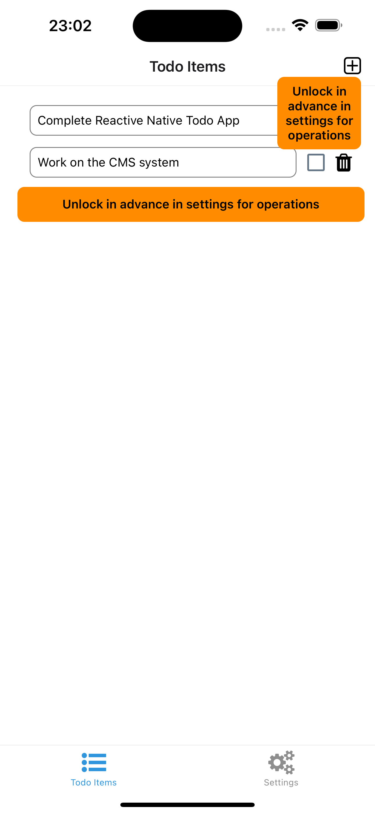

# React Native Todo App

# Objective & Introduction:

This repo aims to provide a basic Todo application integrated with Expo local authentication. Expo and its npm modules are employed to facilitate the development process. Since the application does not have complicated features, but with the fundamental creating, updating, and deleting list items, the state management employs React typical context for global state variables among screens and objects in different nesting levels, and useState hook for local state management.

# Architecture:

## Architecture of directories and files:

```jsx
__todo\-app__
   - [README.md](README.md)
   - __\_\_test\_\___
     - [test\-utils.tsx]             => to allow render component wrapped with provider for testing
   - __app__
     - __(tabs)__
       - [\_layout.tsx]              => to control the tab view base layout and its header
       - [index.tsx]                 => the main view of the list of todo items
       - [settings.tsx]              => the view to allow users to lock/unlock the operations
     - [\_layout.tsx]                => to control the whole layout with Expo router
     - [modal.tsx]                   => the modal view for user to add todo items
   - [app.json]
   - __components__                  => main components for this application
     - [AddItem.tsx]
     - [Themed.tsx]
     - [TodoList.tsx]
     - __\_\_test\_\___              => testing files for the components
       - [AddItem.test.tsx]
       - [TodoList\-locked.test.tsx]
       - [TodoList.test.tsx]
     - [index.ts]
   - __constants__                   => constants used across components and screens
     - [Colors.ts]
     - [TextContent.ts]
     - [index.ts]
   - __store__                       => for statement management with its testing file
     - __\_\_test\_\___
       - [index.test.tsx]
     - [index.tsx]
```

## Architecture of Screens:

This repo is built with Expo offered template for screen with tabs. As a result, two tab screens are implemented. The first one renders the list of the todo items, while the second screen allows users to unlock all the operations with the biometric id.

### Screen 1 - List of The Todo Items (index.tsx)

Here shows the captured screenshots in unlocked state (the first), and in locked state(the second). All the operations initially need users to use their biometric Ids or passwords in their devices to unlock the operations. If in locked state, a popover would prompt users to unlock the operations in the second screen. 




### Screen 2 - Settings (settings.tsx)

The second screen only shows the lock/unlocked state and its switch. Either to turn it on or off, users need to use their biometric Ids or passwords to toggle the switch. Accordingly once users complete the operations of their todo items, they can lock this app to avoid unauthenticated operations. 


### Screen 3 - Modal (modal.tsx)

The modal view for this application aims to allowing users to add their todo items consecutively without distractions. While for practical cases, a POST request would take sometime to send data to backend servers, a modal view could slightly reduce users’ awareness of the time gap between sending data and getting data returned back. Surely the related component can be integrated into the main list view of the todo items. For realistic applications, an option can be configured for allowing users to add new items either in a modal view or in the main list view directively.


## Final Thoughts:

1. The current testing only considers the custom hooks in the store, and also the components. To increase the testing coverage, more testing cases would be required.
2. Some features or configurations can be implemented in the setting screen to enrich this applications given more time.
3. Overall UI/UX can be further optimized with feedbacks from other UI/UX designers.